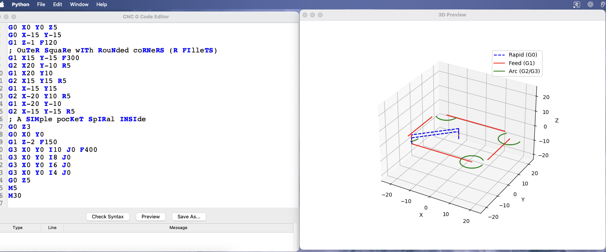
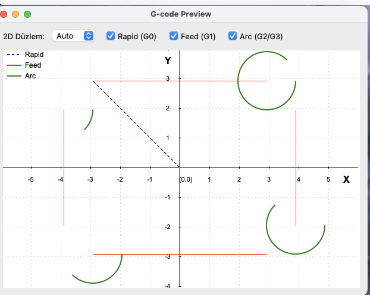
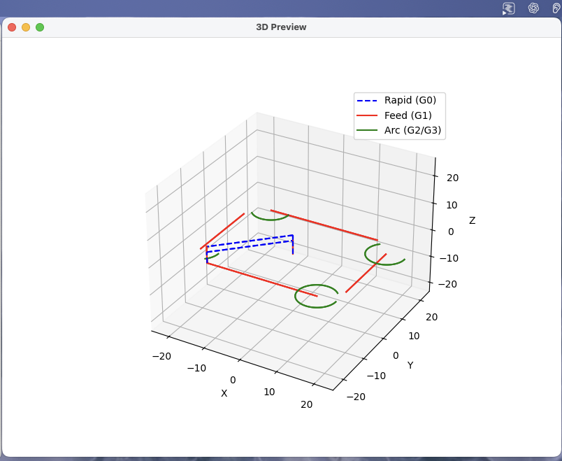

# CNC G-code Editor & Previewer

Python ile yazılmış Tkinter tabanlı bir G-code düzenleyici ve 2D/3D takım yolu önizleyicisidir. Otomatik tamamlama, ipuçları (tooltip), sözdizimi vurgulama ve güvenli/sağlam bir G-code ayrıştırıcı içerir.

## Özellikler

- Gelişmiş G-code editörü (otomatik tamamlama, tooltip, satır numarası)
- Sağlam G-code parser (modal komut takibi, güvenli parametre işleme, düzlem farkındalığı)
- 2D Canvas üzerinde gridli çizim, 3D Matplotlib görselleştirme
- 2D düzlem seçici (Auto/G17/G18/G19) ile XY/XZ/YZ projeksiyonu
- 2D/3D görünürlük anahtarları: Rapid (G0) / Feed (G1) / Arc (G2/G3) filtreleri
- 2D ve 3D'de açıklayıcı legend; düzlem seçimi oturum boyunca hatırlanır
- Editörde sözdizimi hatası/uyarı satır vurgulama (parse diagnostikleri)
- Dosya aç/kaydet/yeni, sözdizimi kontrolü, önizleme butonları
- G17/G18/G19, G20/G21, G90/G91, G94, G28, G54–G59, G0/G1/G2/G3, M3/M4/M5/M6, M30 ve ek M-kodlar (M0/M1/M2/M7/M8/M9) vb. komutları tanır

## Mimari

- `app/main.py`: Uygulama giriş noktası; ana pencere, menüler ve dosya işlemleri.
- `app/gui.py`: Menü çubuğu ve kısayol eylemleri.
- `app/editor.py`: Tkinter Text üzerine kurulu G-code odaklı editör.
- `app/gcode_parser.py`: Modal durum ve güvenli parametre işleme içeren G-code ayrıştırıcı; `{paths, layers}` döndürür. Yol elemanları `line_no` ve `raw` içerir; G2/G3 yayları düzleme göre (G17/G18/G19) I/J/K ile işler.
- `app/preview.py`: Parser çıktısını kullanarak 2D/3D çizim yapar. 2D için grid + merkezleme + ölçekleme, 2D düzlem seçici (Auto/G17/G18/G19) ve güvenli sayısal kontroller vardır.
- `app/data/gcode_definitions.json`: Komut açıklamaları (otomatik tamamlama ve tooltip için).

## Kurulum

> macOS + zsh için örneklenmiştir.

1. Sanal ortam (önerilen)

```bash
python3 -m venv .venv
source .venv/bin/activate
```

1. Bağımlılıklar

```bash
pip install -r requirements.txt
```

Gerekirse doğrudan yükleme:

```bash
pip install matplotlib numpy
```

## Çalıştırma

```bash
python app/main.py
```

## Kullanım

- File > Open ile `.nc`/G-code dosyanızı açın.
- Editörde yazarken otomatik öneriler ve tooltip’ler görünür.
- Önerilerde Enter/Tab ile seçimi uygulayabilirsiniz.
- "Check Syntax" butonu sözdizimini doğrular.
- "Preview" butonu iki ayrı pencerede 2D ve 3D önizleme açar. 2D penceresindeki "2D Düzlem" menüsünden XY/XZ/YZ projeksiyonunu değiştirebilirsiniz. Rapid/Feed/Arc filtre kutularıyla çizim türlerinin görünürlüğünü açıp kapatabilir, legend üzerinden renk/çizgi tiplerini görebilirsiniz. Son seçtiğiniz düzlem, uygulama açık kaldığı sürece hatırlanır.
- File > Save veya "Save As..." ile çıktınızı kaydedin.

## Screenshots

Aşağıdaki görselleri `docs/screenshots` klasörüne yerleştirin (ör. PNG/GIF). Dosya adları örnektir; dilediğiniz gibi adlandırabilirsiniz.

```text
docs/
	screenshots/
		editor.png
		preview-2d.png
		preview-3d.png
		demo.gif
```

Örnek yer tutucular:





## G-code Örneği

`DENEME.nc` dosyasındaki basit örnek ve sonsuz işareti (lemniscate) örneğine bakabilirsiniz.

## Geliştirme İpuçları

- PEP 8’e uyun; fonksiyon/sınıflara kısa docstring ekleyin.
- Parser çıktısı sözleşmesini koruyun: `{"paths": [...], "layers": [...]}`.
- Önizlemede yalnızca `type/start/end` içeren ve sayısal değerleri geçerli olan yolları çizin.

## Sorun Giderme

- Matplotlib/Tk entegrasyonu için sisteminizde uygun Tcl/Tk bulunmalıdır (macOS genellikle yeterlidir). Eksikse Python’u resmi dağıtımdan kurmayı veya `brew install tcl-tk` sonrası uygun `PATH` ayarlarını yapmayı değerlendirebilirsiniz.
- 3D penceresi açılmıyorsa bağımlılıkları tekrar kurun ve terminalde hataları kontrol edin.

## Copilot Yönergeleri

Bu depo için Copilot çalışma kuralları `.github/copilot-instructe.md` dosyasında özetlenmiştir.

## Lisans

Bu proje MIT lisansı ile lisanslanmıştır. Ayrıntılar için `LICENSE` dosyasına bakınız.
